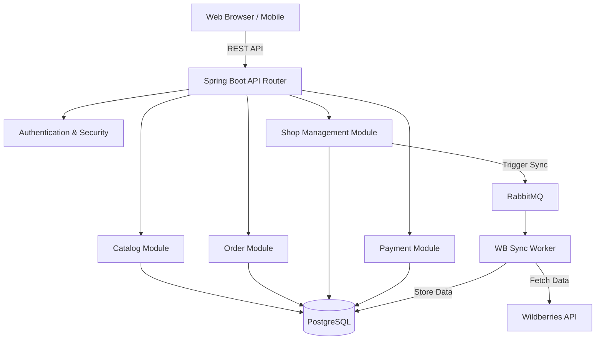

# System Architecture Proposal

## 1. High-Level Architecture Overview

The platform uses a modern, modular monolithic architecture for the backend to simplify deployment while maintaining strong logical separation, which fits the MVP stage perfectly.

- **Frontend (Storefront, Seller Portal, Admin Portal):** Built with Angular v21, served via Nginx or a lightweight Node.js server. The UI communicates with the backend via RESTful APIs.
- **Backend (Spring Boot 4):** Exposes RESTful APIs, handles business logic, security (Spring Security), and orchestrates tasks.
- **Database (PostgreSQL 18):** Relational store for all core data (Users, Shops, Products, Orders, Payments). It will securely store encrypted Wildberries API keys.
- **Message Broker (RabbitMQ):** Handles asynchronous processing for long-running workflows like Wildberries catalog synchronization, email notifications, and order state transition events.

## 2. Component Diagram

## 3. Core Module Structure

The Spring Boot backend will be organized into logical domain modules:

### **User Module**
- Authentication & Authorization (JWT based)
- Role Management (Super Admin, Seller, Customer)
- User Profiles

### **Shop Module**
- Shop Onboarding & Approval flow
- Shop Settings (Contact info, Bank Details)
- Wildberries Credentials Management (Encryption/Decryption)

### **Catalog Module**
- Internal Product Management (Pricing, Inventory, Visibility, custom fields)
- Wildberries Sync Service (Ingests data, maps WB attributes, ensures internal overrides are preserved)
- Taxonomy and Search

### **Order Module**
- Cart Management
- Checkout Flow
- Order State Machine processing (NEW -> ... -> DELIVERED)

### **Payment Module**
- Manual Bank Transfer handling
- Payment Confirmation workflows
- Receipt image uploads functionality (S3 or local filesystem)

### **Notification Module**
- Email dispatcher (via RabbitMQ)
