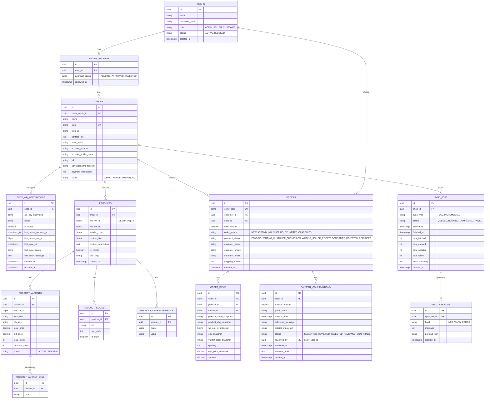

# Database ERD

```mermaid
erDiagram
    USERS {
        uuid id PK
        string email
        string password_hash
        string role "ADMIN, SELLER, CUSTOMER"
        string status "ACTIVE, BLOCKED"
        timestamp created_at
    }

    SELLER_PROFILES {
        uuid id PK
        uuid user_id FK
        string approval_status "PENDING, APPROVED, REJECTED"
        timestamp reviewed_at
    }

    SHOPS {
        uuid id PK
        uuid seller_profile_id FK
        string name
        string slug UK
        string logo_url
        text contact_info
        string bank_name
        string account_number
        string account_holder_name
        string bik
        string correspondent_account
        text payment_instructions
        string status "DRAFT, ACTIVE, SUSPENDED"
    }

    SHOP_WB_INTEGRATIONS {
        uuid id PK
        uuid shop_id FK
        string api_key_encrypted
        string locale
        boolean is_active
        timestamp_tz last_cursor_updated_at
        bigint last_cursor_nm_id
        timestamp last_sync_at
        string last_sync_status
        text last_error_message
        timestamp created_at
        timestamp updated_at
    }

    PRODUCTS {
        uuid id PK
        uuid shop_id FK
        bigint wb_nm_id "UK with shop_id"
        bigint wb_imt_id
        string vendor_code
        string custom_title
        text custom_description
        boolean is_visible
        string seo_slug
        timestamp created_at
    }

    PRODUCT_VARIANTS {
        uuid id PK
        uuid product_id FK
        bigint wb_chrt_id
        string tech_size
        string wb_size
        decimal local_price
        decimal old_price
        int local_stock
        int reserved_stock
        string status "ACTIVE, INACTIVE"
    }

    PRODUCT_VARIANT_SKUS {
        uuid id PK
        uuid variant_id FK
        string sku
    }

    PRODUCT_IMAGES {
        uuid id PK
        uuid product_id FK
        string url
        int sort_order
        boolean is_main
    }

    PRODUCT_CHARACTERISTICS {
        uuid id PK
        uuid product_id FK
        string name
        string value
    }

    ORDERS {
        uuid id PK
        string order_code UK
        uuid customer_id FK
        uuid shop_id FK
        decimal total_amount
        string order_status "NEW, ASSEMBLING, SHIPPING, DELIVERED, CANCELLED"
        string payment_status "PENDING, WAITING_CUSTOMER_SUBMISSION, WAITING_SELLER_REVIEW, CONFIRMED, REJECTED, REFUNDED"
        string customer_name
        string customer_phone
        string customer_email
        text shipping_address
        timestamp created_at
    }

    ORDER_ITEMS {
        uuid id PK
        uuid order_id FK
        uuid product_id FK
        uuid variant_id FK
        string product_name_snapshot
        string product_slug_snapshot
        bigint wb_nm_id_snapshot
        string sku_snapshot
        string variant_label_snapshot
        int quantity
        decimal unit_price_snapshot
        decimal subtotal
    }

    PAYMENT_CONFIRMATIONS {
        uuid id PK
        uuid order_id FK
        decimal transfer_amount
        string payer_name
        timestamp transfer_time
        string reference_message
        string receipt_image_url
        string status "SUBMITTED, REVIEWED_REJECTED, REVIEWED_CONFIRMED"
        uuid reviewed_by FK "seller_user_id"
        timestamp reviewed_at
        text reviewer_note
        timestamp created_at
    }

    SYNC_JOBS {
        uuid id PK
        uuid shop_id FK
        string sync_type "FULL, INCREMENTAL"
        string status "QUEUED, RUNNING, COMPLETED, FAILED"
        timestamp started_at
        timestamp finished_at
        int total_fetched
        int total_created
        int total_updated
        int total_failed
        text error_summary
        timestamp created_at
    }

    SYNC_JOB_LOGS {
        uuid id PK
        uuid sync_job_id FK
        string level "INFO, WARN, ERROR"
        text message
        jsonb payload_json
        timestamp created_at
    }

    USERS ||--o| SELLER_PROFILES : "has"
    SELLER_PROFILES ||--o{ SHOPS : "owns"
    SHOPS ||--o| SHOP_WB_INTEGRATIONS : "configures"
    SHOPS ||--o{ PRODUCTS : "contains"
    PRODUCTS ||--o{ PRODUCT_VARIANTS : "has"
    PRODUCT_VARIANTS ||--o{ PRODUCT_VARIANT_SKUS : "identified by"
    PRODUCTS ||--o{ PRODUCT_IMAGES : "has"
    PRODUCTS ||--o{ PRODUCT_CHARACTERISTICS : "has"
    SHOPS ||--o{ ORDERS : "receives"
    USERS ||--o{ ORDERS : "places"
    ORDERS ||--o{ ORDER_ITEMS : "has"
    ORDERS ||--o{ PAYMENT_CONFIRMATIONS : "has"
    SHOPS ||--o{ SYNC_JOBS : "tracks"
    SYNC_JOBS ||--o{ SYNC_JOB_LOGS : "generates"
```
